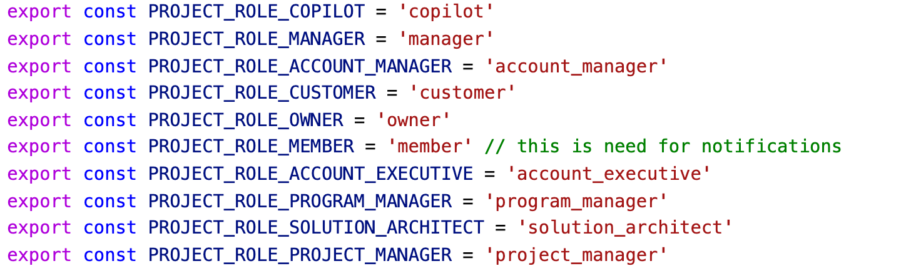

# Permissions Guide

## References

- [Permissions list](https://htmlpreview.github.io/?https://github.com/appirio-tech/connect-app/blob/dev/docs/permissions.html)

- [Permissions list source](https://github.com/appirio-tech/connect-app/blob/dev/src/config/permissions.js)

## How to Use

Let's say you would like to add a new place in code where you want to check user roles/permissions. Please, follow the next guide:

1. Check if we already have defined permission for your case in the [permissions list](https://htmlpreview.github.io/?https://github.com/appirio-tech/connect-app/blob/dev/docs/permissions.html).

2. If you cannot find the permission you need, add new permission to the file https://github.com/appirio-tech/connect-app/blob/dev/src/config/permissions.js.

   1. Follow the guides on how to add a new permission in the header of this file.

   2. After you add a new permission, regenerate [permissions list](https://htmlpreview.github.io/?https://github.com/appirio-tech/connect-app/blob/dev/docs/permissions.html) by running `npm run generate:doc:permissions`.

3. To check if user has permission in code use method `hasPermission(permission)`.

   Example:<br>
    
   ```js
   import PERMISSIONS from 'config/permissions'
   import { hasPermission } from 'helpers/permissions'

   if (hasPermission(PERMISSIONS.MANAGE_PROJECT_PLAN)) {
      ...
   }
   ```

   - Note, optionally, you may pass the `project` object like this `hasPermission(permission, project)`. But you don't have to as `hasPermission` gets `project` object from the Redux Store (`projectState.project`) automatically. Only in case if you want to check user permission to another project which is not loaded into the Redux Store then you may pass `project` explicitly.

## Roles

Every user may have 2 kind of roles: **Topcoder Roles** and **Project Role**.

### Topcoder Roles

These roles are assigned to user accounts. User may have several **Topcoder Roles**. See [the list of all Topcoder Roles](https://github.com/appirio-tech/connect-app/blob/dev/src/config/constants.js#L656-L668) which we use in Connect App.


By default every user has one role `Topcoder User`, generally this means that such a user is either **customer** or **community member** (freelancer).

### Project Role

When user joins some project and become a member of the project, such a user has one **Project Role** inside that project. One user may have different **Project Role** in different projects. See [the list of all Project Roles](https://github.com/appirio-tech/connect-app/blob/dev/src/config/constants.js#L638-L647) which we use in Connect App.

